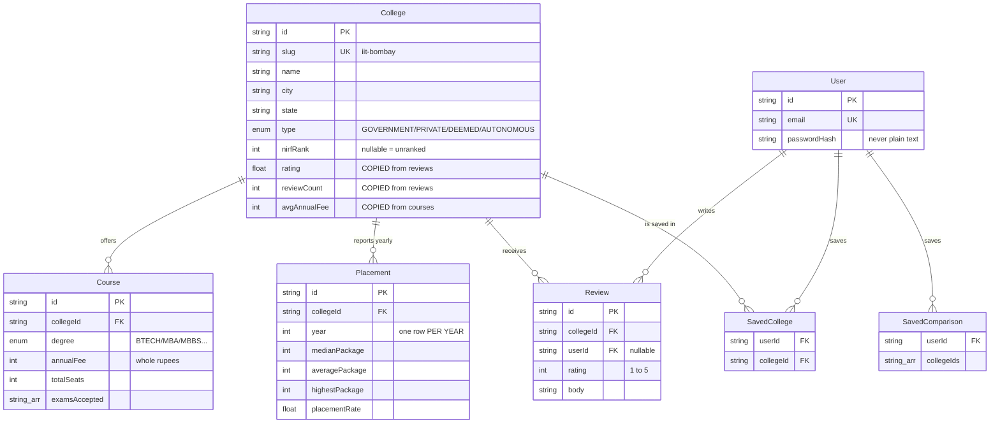

# 📒 College Compass — My Learning Notes

> My own notes for this project. Written in simple language so I can revise
> before the review call. Every decision here I can explain myself.

---

## 1. What am I building?

A website where a student can **find and compare colleges** before deciding
where to apply. Like `careers360.com` or `collegedunia.com`, but smaller and
built properly.

**My role:** Full Stack Engineer
**My track:** Track A — College Discovery Platform

**4 features I chose:**

| # | Feature | What it does |
|---|---------|--------------|
| 1 | College Listing + Search | Search, filter and page through colleges |
| 2 | College Detail Page | One college: courses, placements, reviews |
| 3 | Compare Colleges | Put 2–3 colleges side by side |
| 4 | Auth + Saved Items | Login, save colleges and comparisons |

**I did NOT choose** Predictor and Q&A. Not because they are hard — because
4 features done well beats 6 done badly. The assignment literally says
"choose ANY 3–4 features and execute them extremely well."

---

## 2. My tech stack (and WHY each one)

```
┌─────────────────────────────────────────────────────────┐
│  BROWSER                                                 │
│  React 19  +  Next.js 16  +  TailwindCSS v4              │
└───────────────────────┬─────────────────────────────────┘
                        │  HTTP
┌───────────────────────▼─────────────────────────────────┐
│  SERVER  (same Next.js app)                              │
│  Route Handlers  →  Zod validation  →  Prisma            │
└───────────────────────┬─────────────────────────────────┘
                        │  SQL over TCP
┌───────────────────────▼─────────────────────────────────┐
│  DATABASE                                                │
│  PostgreSQL, hosted on Neon                              │
└──────────────────────────────────────────────────────────┘
```

| Piece | Why I picked it |
|-------|-----------------|
| **Next.js 16** | Frontend + backend in ONE project. One deploy, one repo. |
| **TypeScript** | Catches mistakes while typing, not in production. |
| **TailwindCSS v4** | Styling without writing separate CSS files. |
| **Route Handlers** (not NestJS) | NestJS = a second server to host. Too costly in 48 hours. |
| **PostgreSQL** | Real relational DB. Handles joins, constraints, indexes. |
| **Neon** | Postgres in the cloud, free tier. No install needed on my laptop. |
| **Prisma 7** | ORM. I write TypeScript, it writes SQL. Full type safety. |
| **Zod 4** | Checks every piece of user input before it reaches the database. |
| **jose + bcryptjs** | Hand-rolled auth. ~100 lines I fully understand. |

> ❓ **If they ask "why not NestJS?"**
> "NestJS is a great framework, but it means deploying a second service.
> With Next.js Route Handlers I get one deployment, one repo, and shared
> TypeScript types between frontend and backend. At this scope that is
> strictly simpler with no real loss."

---

## 3. Folder structure

```
college-compass/
│
├── prisma/
│   ├── schema.prisma          ← THE MOST IMPORTANT FILE. All 8 tables.
│   ├── migrations/            ← Real SQL files. History of DB changes.
│   ├── data/
│   │   ├── colleges.ts        ← 120 real colleges (just data)
│   │   └── generate.ts        ← Makes fees, placements, reviews
│   └── seed.ts                ← Fills the database  (NEXT TO BUILD)
│
├── src/
│   ├── lib/
│   │   ├── env.ts             ← Checks .env is correct at startup
│   │   └── prisma.ts          ← The one shared database connection
│   ├── app/                   ← Pages and API routes go here
│   └── generated/prisma/      ← Prisma auto-writes this. Not committed.
│
├── .env                       ← My secrets. NEVER committed.
├── .env.example               ← Template. IS committed.
└── prisma.config.ts           ← Prisma 7 config (holds the DB url)
```

---

## 4. The database — 8 tables



**PK** = Primary Key (the id) · **FK** = Foreign Key (points to another table) · **UK** = Unique Key

---

## 5. My 6 big database decisions

These are the ones a reviewer will ask about. I must be able to say these
in my own words.

### ✅ Decision 1 — Money is `Int`, never `Float`

```
Computer stores 0.1 like this:  0.1000000000000000055511151231257827
Add it 3 times:                 0.30000000000000004   ← WRONG
```

Computers store numbers in **binary**. Some decimal numbers (like 0.1) have
no exact binary form — same way 1/3 has no exact decimal form (0.3333...).
Small errors add up.

**My fix:** store ₹1,50,000 as the integer `150000`. No decimals, no error.

```
❌ annualFee  Float   →  150000.00000000001
✅ annualFee  Int     →  150000
```

> Every bank and payment system does this. Store the smallest whole unit.

---

### ✅ Decision 2 — Denormalisation (the interesting one)

**The problem:**

`rating` really lives in the `Review` table. To show it on the listing page,
the "correct" way is:

```sql
SELECT College.*, AVG(Review.rating)
FROM College
LEFT JOIN Review ON Review.collegeId = College.id
GROUP BY College.id
ORDER BY AVG(Review.rating) DESC;
```

That runs on **every single keystroke** while the user types in the search
box. With thousands of colleges and lakhs of reviews, this gets slow.

**My fix:** copy the answer onto the `College` row.

```
        THE "CORRECT" WAY                    MY WAY
        ─────────────────                    ──────

  College ──JOIN──► Review              College
     │              (100000s              ├── rating: 4.6      ← copied
     │               of rows)             ├── reviewCount: 12  ← copied
     ▼                                    └── avgAnnualFee     ← copied
  compute AVG every request
  😰 slow                                 😀 instant read
```

**The trade-off I accepted:**

| | Reads | Writes |
|---|---|---|
| Normalised (join every time) | 🐢 slow | 😀 simple |
| Denormalised (my choice) | ⚡ fast | 😐 must keep in sync |

**Why it is the right call here:** this is a *discovery* product. People
browse and search constantly, but reviews are written rarely. Optimise for
the thing that happens 1000x more often.

**Where I keep it in sync:** the seed script computes it, and the
"create review" endpoint will recalculate it.

> 🗣️ **My one-line answer:** *"rating and avgAnnualFee are denormalised.
> They're derived from child rows, but the listing page filters and sorts on
> them across the whole table, so a JOIN + GROUP BY per keystroke wouldn't
> scale. I traded slightly harder writes for much faster reads, which is
> right for a read-heavy discovery product."*

---

### ✅ Decision 3 — Placements are a TIME SERIES

**The lazy way** (columns on College):

```
College
├── medianPackage2023
├── medianPackage2024
└── medianPackage2025     ← want 2026? Need a MIGRATION. 😩
```

**My way** (separate table, one row per year):

```
Placement
┌───────────┬──────┬───────────────┐
│ collegeId │ year │ medianPackage │
├───────────┼──────┼───────────────┤
│ iit-b     │ 2023 │   16,00,000   │
│ iit-b     │ 2024 │   17,10,000   │
│ iit-b     │ 2025 │   18,30,000   │  ← want 2026? Just INSERT a row. 😀
└───────────┴──────┴───────────────┘
```

Now I can draw a **trend line** on the detail page. And adding a year needs
zero schema changes.

Plus this line in the schema:

```prisma
@@unique([collegeId, year])
```

This means **one college cannot have two rows for the same year.**
Postgres itself blocks it. Even if my code has a bug, or someone
double-clicks a form, the bad data **physically cannot be saved**.

---

### ✅ Decision 4 — Unique constraint makes "Save" safe

Problem: user clicks "Save college" twice fast. Do I get 2 rows?

**The naive fix (has a hidden bug):**

```
Request A: check if exists? → NO
Request B: check if exists? → NO     ← both checked before either wrote!
Request A: INSERT                     → row 1
Request B: INSERT                     → row 2   ❌ duplicate
```

This is a **race condition**. The gap between "check" and "write" is where
the bug lives.

**My fix — let the database decide:**

```prisma
@@unique([userId, collegeId])
```

Now I use ONE atomic command instead of two:

```ts
prisma.savedCollege.upsert(...)   // "insert, or do nothing if it exists"
```

There is no gap, so there is no race.

> 🗣️ **My one-liner:** *"Put correctness guarantees in the database, not in
> application code. Application code has race conditions; a unique constraint
> doesn't."*

---

### ✅ Decision 5 — `Cascade` vs `SetNull`

What happens to child rows when the parent is deleted?

```
DELETE a College                       DELETE a User
      │                                      │
      ├─► Course      → CASCADE  (delete)    ├─► SavedCollege → CASCADE (delete)
      ├─► Placement   → CASCADE  (delete)    └─► Review       → SET NULL
      └─► Review      → CASCADE  (delete)             │
                                                      ▼
                                           Review stays, but becomes
                                           anonymous. The opinion is
                                           still useful to other students!
```

**Reasoning:** A course cannot exist without its college — meaningless.
But a review *can* exist without its author — it still helps readers.
**Different data, different lifetime.**

---

### ✅ Decision 6 — One index per real access pattern

```prisma
@@index([state])
@@index([type])
@@index([rating])
@@index([avgAnnualFee])
@@index([nirfRank])
```

**What an index is (simple version):** like the index at the back of a
textbook. Without it, finding "colleges in Karnataka" means reading every
single row. With it, Postgres jumps straight there.

**But indexes are not free:**

```
Every INSERT / UPDATE  →  must also update EVERY index
More indexes  =  slower writes  +  more disk
```

So I added exactly one for each thing the listing page filters or sorts on.
**No extras.** An index nobody uses is pure cost.

---

## 6. New things in Prisma 7 (tutorials online are outdated!)

### ⚠️ Change 1 — no `url` in `schema.prisma`

```prisma
datasource db {
  provider = "postgresql"
  // url = env("DATABASE_URL")   ← this is GONE in v7
}
```
The url now lives in `prisma.config.ts`.

### ⚠️ Change 2 — client is generated into MY folder

```prisma
generator client {
  provider = "prisma-client"
  output   = "../src/generated/prisma"   ← not node_modules anymore
}
```
So I import from `@/generated/prisma/client`.

### ⚠️ Change 3 — a driver adapter is REQUIRED

```ts
// ❌ Old way — throws an error in v7
new PrismaClient()

// ✅ Prisma 7 way
const adapter = new PrismaPg({ connectionString: env.DATABASE_URL });
new PrismaClient({ adapter });
```

**Why this is actually better:** Prisma used to ship a 15MB Rust binary to
talk to the database. Now it uses the normal `pg` Node driver. Smaller
serverless bundle, behaves like any other Postgres client.

### ⚠️ Change 4 — `postinstall` is required for deployment

```json
"postinstall": "prisma generate"
```

`src/generated/` is **gitignored** (it is generated code, so committing it
is wrong). But that means when Vercel clones my repo, the folder is missing
and the build fails. `postinstall` regenerates it automatically.

> This is the #1 first-deploy failure with Prisma. Already solved.

---

## 7. The hot-reload connection leak 🔥

This one is subtle and worth knowing.

```ts
// ❌ Looks fine. Destroys your dev database.
export const prisma = new PrismaClient({ adapter });
```

**What happens:**

```
Save file  →  Next.js hot-reloads the module
           →  new PrismaClient()  →  new connection pool
Save again →  another one
Save again →  another one
... 15 saves later ...
           →  💥 "too many clients already"
```

It looks like a database problem. It is really a **module lifecycle**
problem.

**My fix** in `src/lib/prisma.ts`:

```ts
const globalForPrisma = globalThis as unknown as { prisma: PrismaClient | undefined };

export const prisma = globalForPrisma.prisma ?? createPrismaClient();

if (env.NODE_ENV !== "production") {
  globalForPrisma.prisma = prisma;
}
```

`globalThis` is **not** cleared by hot reload, so the same client survives
every save.

**Why skip it in production?** In production the module loads exactly once,
so the global is unnecessary — and leaking app objects into global scope for
no reason is bad practice.

---

## 8. Why validate `.env` with Zod?

```ts
process.env.DATABASE_URL   // TypeScript says: string | undefined
```

That `undefined` is the problem. Two bad options:

```ts
process.env.DATABASE_URL!        // ❌ lying to the compiler
if (!process.env.DATABASE_URL)   // ❌ nobody writes this everywhere
```

Both fail the same way: **app starts fine, crashes later in front of a user.**

**My fix:** check ONCE at startup with Zod, export a typed object.

```
       WITHOUT validation                  WITH validation
       ─────────────────                   ───────────────
  App starts       ✅                  App refuses to start  ❌
  User visits page ✅                  Clear message:
  User clicks save ✅                    "JWT_SECRET must be at
  Query runs       💥 crash               least 32 characters"
  (2 AM, in production)                 (immediately, on my laptop)
```

**Fail fast, fail loud, fail early.**

Also — `JWT_SECRET` minimum is **32 characters** for a real reason. HS256
signing security depends entirely on that secret being long. A short secret
= anyone can forge a login cookie for any user = total auth bypass.

---

## 9. The seed data files

### 🎲 Why NOT `Math.random()`

```
        Math.random()                    Seeded PRNG (my choice)
        ─────────────                    ───────────────────────
 seed run 1 → IIT-B rating 4.6      seed run 1 → IIT-B rating 4.6
 seed run 2 → IIT-B rating 4.1      seed run 2 → IIT-B rating 4.6
 seed run 3 → IIT-B rating 3.9      seed run 3 → IIT-B rating 4.6

 ❌ My Loom video stops matching     ✅ Same forever, on any machine
 ❌ Bug at demo → can't reproduce    ✅ Reseed and it's back
```

**How it works:**

```
"iit-bombay"  ──FNV-1a hash──►  2847193056  ──mulberry32──►  0.734, 0.221, 0.891...
   (slug)                        (32-bit seed)                 (always the same!)
```

**Key detail:** I seed from each college's **slug**, not a global counter.

```
❌ Global counter: insert 1 new college at position 5
                   →  EVERY college after it gets different data

✅ Per-slug seed:   insert 1 new college anywhere
                   →  every other college is untouched
```

### 🔀 The shuffle bug everyone writes

```ts
items.sort(() => Math.random() - 0.5)   // ❌ NOT a fair shuffle
```

Sorting algorithms assume the comparator is **consistent** (if a > b, then
b < a). A random comparator breaks that promise, and the result is
measurably biased — some orders come up far more often than others.

**Fisher–Yates** is provably uniform and O(n):

```
Start:  [A, B, C, D]
i=3 →  pick random j in 0..3, swap with position 3
i=2 →  pick random j in 0..2, swap with position 2
i=1 →  pick random j in 0..1, swap with position 1
Done:  fair shuffle ✅
```

Also — I copy the array first (`[...items]`). Shuffling sorts **in place**,
so without the copy I would permanently scramble my shared constant arrays.
First college works, all others silently broken.

### 📋 Lookup table > clever formula

I first tried: `fee = base × typeMultiplier × tierMultiplier`, with
`GOVERNMENT = cheap`.

**It gave wrong numbers.** Look at reality:

```
                 GOVERNMENT      DEEMED
ENGINEERING      ₹2,20,000  ←→   ₹4,50,000     gov is EXPENSIVE
MEDICAL          ₹   45,000 ←→   ₹19,00,000    gov is CHEAP
```

No single "government multiplier" produces both ₹2.2L and ₹45k.
So I wrote an explicit **8 streams × 4 types = 32 number** table instead.

> 🗣️ **The lesson:** when reality has no clean rule, a lookup table I can
> defend line by line beats a formula that is elegant and wrong.

### 🔍 Small touches that make fake data look real

| Trick | Why |
|-------|-----|
| Round to nearest ₹500 | Real fees are ₹2,25,500 — not ₹2,13,847 |
| average **always** > median | Salary data is right-skewed. A few huge offers pull the mean up, median barely moves |
| 7% growth per year | Makes the trend line real, not 3 random numbers |
| Tier-1 ratings still include 3★ | If every top college = 5.0, "sort by rating" has nothing to sort |
| IITs → "JEE Advanced", NITs → "JEE Main" | Makes the exam filter meaningful, not decorative |

### ⚖️ Honesty about the data

- Names, cities, states, founding years, ownership type → **real**
- Fees, packages, placement rates, reviews → **representative sample data**

This is stated in the file header, in the README, and in the site footer.
Never present generated numbers as real research.

---

## 10. Commands cheat sheet

```bash
npm run dev          # start dev server → localhost:3000
npm run build        # production build (run before deploying!)
npm run typecheck    # tsc --noEmit — catches type errors
npm run lint         # eslint

npx prisma migrate dev --name <name>   # change schema → new migration
npm run db:seed                        # fill database with data
npm run db:reset                       # wipe + re-seed  ⚠️ deletes everything
npm run db:studio                      # visual database browser
npx prisma validate                    # is my schema valid?
npx prisma generate                    # rebuild the typed client
```

---

## 11. Progress tracker

- [x] Scaffold Next.js 16 + TS + Tailwind v4
- [x] Design schema (8 tables, 3 enums)
- [x] Connect Neon Postgres
- [x] First migration applied
- [x] `env.ts` — Zod-validated config
- [x] `prisma.ts` — singleton client with driver adapter
- [x] Seed data files (120 colleges + generators)
- [ ] `seed.ts` — fill the database  ← **I am here**
- [ ] Listing API (search, filter, sort, paginate)
- [ ] Listing page UI
- [ ] Detail page
- [ ] Compare feature
- [ ] Auth (signup / login / logout)
- [ ] Saved colleges + saved comparisons
- [ ] Deploy to Vercel
- [ ] README + Loom video

---

## 12. My Loom video plan (5–10 min)

| Time | What to say |
|------|-------------|
| 0:00–0:45 | What I built, which role + track, which 4 features and **why I cut the other two** |
| 0:45–2:30 | **Live demo:** search → filter → detail page → compare → save. Keep it fast. |
| 2:30–5:00 | **Architecture:** show the ER diagram. Explain denormalisation, the time-series placements, and the unique constraints. This is the highest-value section. |
| 5:00–6:30 | **Filters live in the URL, not React state** — show the shareable link and the working back button |
| 6:30–7:30 | **Edge cases:** invalid query params, empty results, duplicate saves, deleted users |
| 7:30–8:00 | **Trade-offs:** what I would do differently with more time |

**Rule for the video:** for every feature, say *why*, not just *what*.
"I used X" is weak. "I used X **because** Y, and the cost was Z" is strong.
